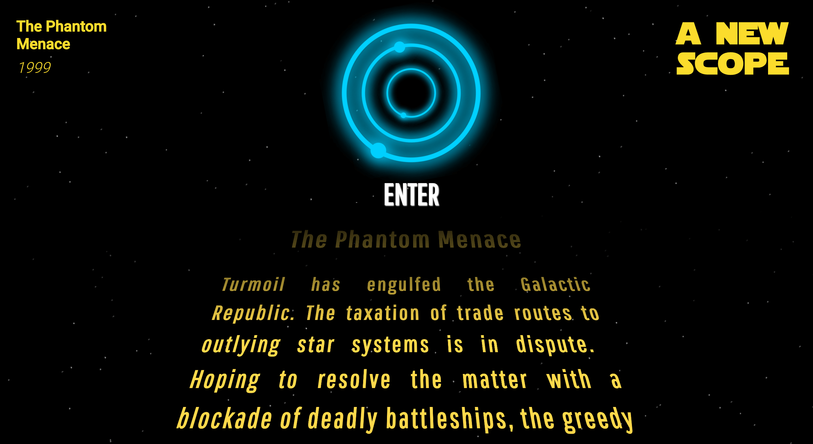

# A New Scope

### Abstract

The goal of this project was to build an app in React using the Star Wars API. Data is fetched from the SWAPI and displayed in categories, from which users can select favorites, which will persist in localStorage. This app also features the iconic Star Wars opening crawl and is fully tested and responsive.

#### View the live site [here](), or follow the instructions below to install locally

### Setup

```
git clone https://github.com/jakelauer27/a-new-scope.git

cd a-new-scope

npm install

npm start
```




### Wireframes 


### Primary Technologies Used

- ReactJS
- JSX
- Fetch API
- Jest/Enzyme
- React Router
- Sass

### Authors

- Jake Lauer
  - https://github.com/jakelauer27
- Jamie Rushford
  - https://github.com/jarushford
